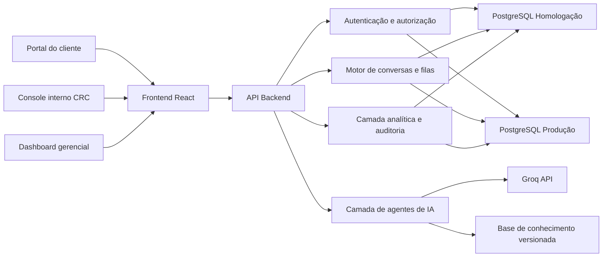
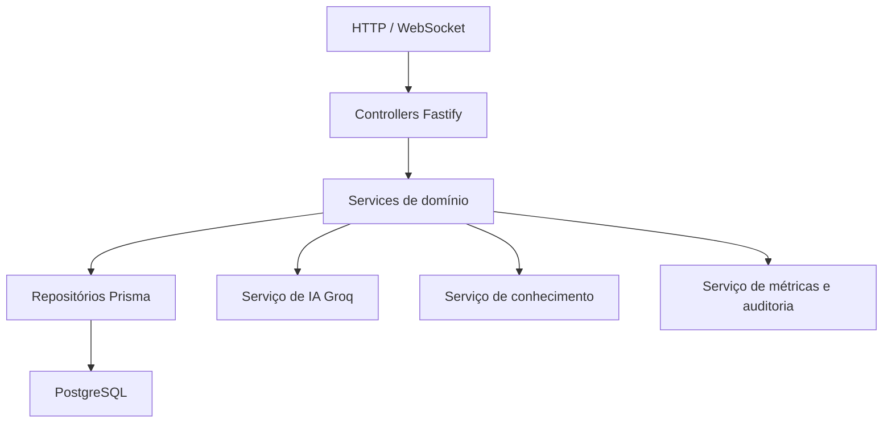
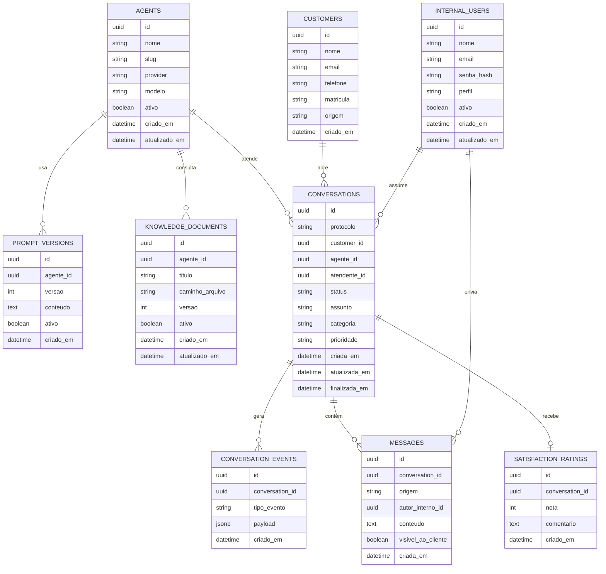

## 1. Desenho da Arquitetura


## 2. Descrição Tecnológica
- Frontend: React 18 + TypeScript + Vite + Tailwind CSS 3
- Backend: Node.js 22 + Fastify + TypeScript
- Tempo real: WebSocket com Socket.IO
- ORM: Prisma
- Autenticação: sessão com JWT em cookie `HttpOnly` + hash de senha com `bcrypt`
- Banco oficial de dados: PostgreSQL 16
- Uploads e documentos da base de conhecimento: volume persistente no EasyPanel no MVP
- IA: Groq via API, com prompts versionados por agente
- Implantação: EasyPanel na Hostinger VPS KVM2 com serviços separados para frontend, backend e banco

### 2.1 Estratégia de Banco de Dados
- **Teste/Homologação**: PostgreSQL 16 em serviço separado no EasyPanel, com base dedicada `crc_hml`
- **Produção**: PostgreSQL 16 em serviço separado no EasyPanel, com base dedicada `crc_prod`
- **Testes automatizados locais**: opcionalmente `SQLite` em memória apenas para testes unitários rápidos do domínio, sem substituir a homologação oficial

### 2.2 Justificativa da Escolha
- PostgreSQL é estável, maduro, excelente para consultas analíticas e adequado para mensageria persistida.
- Usar PostgreSQL tanto em homologação quanto em produção reduz divergência de comportamento.
- A operação em VPS com EasyPanel fica simples de administrar, fazer backup e restaurar.

## 3. Definição de Rotas
| Rota | Finalidade |
|---|---|
| `/` | Landing institucional com escolha entre iniciar atendimento e acessar área interna |
| `/atendimento` | Portal do cliente para iniciar e continuar conversas |
| `/entrar` | Login interno com validação de domínio `@cooxupe.com.br` |
| `/recuperar-senha` | Recuperação de senha para usuários internos |
| `/app/fila` | Inbox operacional do CRC com fila e distribuição de conversas |
| `/app/conversas/:id` | Tela detalhada da conversa com histórico, contexto e ações |
| `/app/gestao` | Dashboard executivo com métricas operacionais e gerenciais |
| `/app/gestao/conversas` | Base analítica detalhada de atendimentos |
| `/app/agentes` | Configuração de agentes de IA, prompts e regras |
| `/app/conhecimento` | Gestão de bases de conhecimento e documentos |
| `/app/usuarios` | Administração de usuários internos e perfis |
| `/app/auditoria` | Histórico administrativo e eventos críticos |

## 4. Definições de API

### 4.1 Tipos de Dados Principais
```ts
type PerfilInterno = "admin" | "supervisor" | "atendente"

type UsuarioInterno = {
  id: string
  nome: string
  email: string
  perfil: PerfilInterno
  ativo: boolean
  criadoEm: string
}

type ClienteAtendimento = {
  id: string
  nome: string
  email?: string | null
  telefone?: string | null
  matricula?: string | null
  origem: "portal_crc"
  criadoEm: string
}

type StatusConversa =
  | "nova"
  | "em_atendimento_ia"
  | "aguardando_humano"
  | "em_atendimento_humano"
  | "aguardando_cliente"
  | "finalizada"

type OrigemMensagem = "cliente" | "ia" | "atendente" | "sistema"

type Conversa = {
  id: string
  protocolo: string
  clienteId: string
  status: StatusConversa
  agenteId?: string | null
  atendenteId?: string | null
  assunto?: string | null
  categoria?: string | null
  prioridade: "baixa" | "normal" | "alta"
  criadaEm: string
  atualizadaEm: string
  finalizadaEm?: string | null
}

type Mensagem = {
  id: string
  conversaId: string
  origem: OrigemMensagem
  autorId?: string | null
  conteudo: string
  visivelAoCliente: boolean
  criadaEm: string
}

type AgenteIA = {
  id: string
  nome: string
  slug: string
  provider: "groq"
  modelo: string
  promptSistemaVersaoId: string
  ativo: boolean
}

type DocumentoConhecimento = {
  id: string
  agenteId: string
  titulo: string
  caminhoArquivo: string
  versao: number
  ativo: boolean
  atualizadoEm: string
}
```

### 4.2 Endpoints Principais
| Método | Endpoint | Finalidade |
|---|---|---|
| `POST` | `/api/auth/register` | Cadastra usuário interno com validação obrigatória do domínio `@cooxupe.com.br` |
| `POST` | `/api/auth/login` | Autentica usuário interno e cria sessão segura |
| `POST` | `/api/auth/forgot-password` | Inicia recuperação de senha |
| `POST` | `/api/clientes/sessoes` | Cria sessão de atendimento do cliente |
| `POST` | `/api/conversas` | Abre nova conversa |
| `GET` | `/api/conversas/:id` | Retorna detalhes da conversa |
| `POST` | `/api/conversas/:id/mensagens` | Envia nova mensagem |
| `POST` | `/api/conversas/:id/assumir` | Atendente assume a conversa |
| `POST` | `/api/conversas/:id/transferir-para-humano` | IA ou regra de negócio envia conversa para a fila humana |
| `POST` | `/api/conversas/:id/finalizar` | Finaliza atendimento |
| `POST` | `/api/conversas/:id/avaliacao` | Registra avaliação do cliente |
| `GET` | `/api/fila` | Lista fila operacional com filtros |
| `GET` | `/api/gestao/kpis` | Retorna KPIs do dashboard |
| `GET` | `/api/gestao/conversas` | Retorna base analítica filtrável |
| `GET` | `/api/agentes` | Lista agentes configurados |
| `POST` | `/api/agentes` | Cria ou atualiza agente de IA |
| `GET` | `/api/conhecimento` | Lista documentos da base de conhecimento |
| `POST` | `/api/conhecimento/upload` | Faz upload de novo documento |

### 4.3 Regras de Segurança
- O backend validará o e-mail interno com regex específica para `@cooxupe.com.br`.
- A senha será armazenada somente com hash forte.
- O `GROQ_API_KEY` ficará em variável de ambiente no EasyPanel.
- Todas as ações sensíveis gerarão registros em auditoria.
- Rotas internas usarão autorização por perfil.

## 5. Diagrama da Arquitetura do Servidor


## 6. Modelo de Dados
### 6.1 Definição do Modelo


### 6.2 Linguagem de Definição de Dados
```sql
create extension if not exists "pgcrypto";

create table internal_users (
  id uuid primary key default gen_random_uuid(),
  nome varchar(120) not null,
  email varchar(255) not null unique,
  senha_hash varchar(255) not null,
  perfil varchar(20) not null check (perfil in ('admin', 'supervisor', 'atendente')),
  ativo boolean not null default true,
  criado_em timestamptz not null default now(),
  atualizado_em timestamptz not null default now(),
  constraint internal_users_email_domain_ck
    check (lower(email) ~ '^[a-z0-9._%+-]+@cooxupe\.com\.br$')
);

create table customers (
  id uuid primary key default gen_random_uuid(),
  nome varchar(160) not null,
  email varchar(255),
  telefone varchar(30),
  matricula varchar(60),
  origem varchar(30) not null default 'portal_crc',
  criado_em timestamptz not null default now()
);

create table agents (
  id uuid primary key default gen_random_uuid(),
  nome varchar(120) not null,
  slug varchar(120) not null unique,
  provider varchar(30) not null default 'groq',
  modelo varchar(120) not null,
  ativo boolean not null default true,
  criado_em timestamptz not null default now(),
  atualizado_em timestamptz not null default now()
);

create table prompt_versions (
  id uuid primary key default gen_random_uuid(),
  agente_id uuid not null references agents(id) on delete cascade,
  versao integer not null,
  conteudo text not null,
  ativo boolean not null default false,
  criado_em timestamptz not null default now(),
  unique (agente_id, versao)
);

create table knowledge_documents (
  id uuid primary key default gen_random_uuid(),
  agente_id uuid not null references agents(id) on delete cascade,
  titulo varchar(255) not null,
  caminho_arquivo varchar(500) not null,
  versao integer not null default 1,
  ativo boolean not null default true,
  criado_em timestamptz not null default now(),
  atualizado_em timestamptz not null default now()
);

create table conversations (
  id uuid primary key default gen_random_uuid(),
  protocolo varchar(30) not null unique,
  customer_id uuid not null references customers(id),
  agente_id uuid references agents(id),
  atendente_id uuid references internal_users(id),
  status varchar(30) not null check (
    status in (
      'nova',
      'em_atendimento_ia',
      'aguardando_humano',
      'em_atendimento_humano',
      'aguardando_cliente',
      'finalizada'
    )
  ),
  assunto varchar(255),
  categoria varchar(120),
  prioridade varchar(20) not null default 'normal' check (prioridade in ('baixa', 'normal', 'alta')),
  criada_em timestamptz not null default now(),
  atualizada_em timestamptz not null default now(),
  finalizada_em timestamptz
);

create table messages (
  id uuid primary key default gen_random_uuid(),
  conversation_id uuid not null references conversations(id) on delete cascade,
  origem varchar(20) not null check (origem in ('cliente', 'ia', 'atendente', 'sistema')),
  autor_interno_id uuid references internal_users(id),
  conteudo text not null,
  visivel_ao_cliente boolean not null default true,
  criada_em timestamptz not null default now()
);

create table conversation_events (
  id uuid primary key default gen_random_uuid(),
  conversation_id uuid not null references conversations(id) on delete cascade,
  tipo_evento varchar(80) not null,
  payload jsonb not null default '{}'::jsonb,
  criado_em timestamptz not null default now()
);

create table satisfaction_ratings (
  id uuid primary key default gen_random_uuid(),
  conversation_id uuid not null unique references conversations(id) on delete cascade,
  nota integer not null check (nota between 1 and 5),
  comentario text,
  criado_em timestamptz not null default now()
);

create index idx_conversations_status on conversations(status);
create index idx_conversations_criada_em on conversations(criada_em desc);
create index idx_messages_conversation_created on messages(conversation_id, criada_em);
create index idx_events_conversation_created on conversation_events(conversation_id, criado_em);
create index idx_internal_users_email on internal_users(email);
```

## 7. Arquitetura de Implantação no EasyPanel
- Serviço `frontend`: aplicação React servida por Nginx
- Serviço `api`: backend Fastify com suporte a HTTP e WebSocket
- Serviço `postgres-hml`: banco de homologação
- Serviço `postgres-prod`: banco de produção
- Volumes persistentes para banco e documentos da base de conhecimento
- Variáveis de ambiente segregadas por ambiente
- Rotina de backup diário do PostgreSQL com retenção mínima de 7 dias

## 8. Estratégia de Realtime e Filas
- Mensagens novas serão persistidas primeiro no banco e publicadas em seguida via WebSocket.
- A fila operacional será calculada por status, prioridade, tempo de espera e regras de distribuição.
- O handoff IA para humano registrará evento explícito para análise posterior.
- Em caso de indisponibilidade temporária da IA, o sistema continuará permitindo atendimento humano direto.

## 9. Decisões Técnicas Relevantes
- O portal do cliente será desacoplado da autenticação corporativa para manter baixa fricção.
- O dashboard analítico não será descartado; ele evoluirá para o módulo `/app/gestao`.
- O arquivo `SYSTEM PROMPT - Assistente Salesforce` será a primeira versão de prompt do agente.
- O segredo da Groq não será persistido em banco nem embutido no frontend.
- O MVP priorizará texto em tempo real e base documental; anexos ricos e omnichannel podem entrar em fase posterior.
