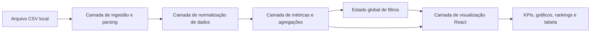
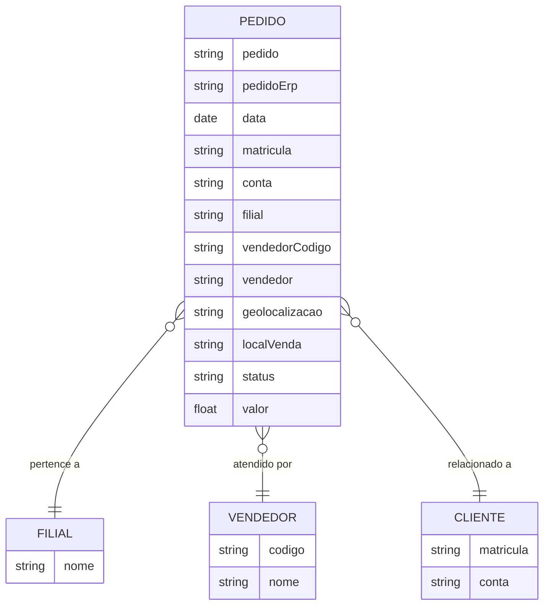

## 1. Desenho da Arquitetura


## 2. Descrição Tecnológica
- Frontend: React 18 + TypeScript + Vite
- Estilo: Tailwind CSS 3 com tokens visuais customizados
- Visualização de dados: Recharts
- Manipulação local de dados: utilitários TypeScript próprios para parsing, agregação, filtros e cálculos
- Fonte de dados: arquivo CSV local carregado do diretório público da aplicação
- Implantação: aplicação estática client-side sem backend

## 3. Definição de Rotas
| Rota | Finalidade |
|---|---|
| `/` | Dashboard executivo completo com filtros, KPIs, gráficos, rankings e tabela analítica |

## 4. Definições de API
Sem backend nesta primeira versão. Toda a transformação acontece no navegador a partir do arquivo CSV.

### 4.1 Tipos de Dados Principais
```ts
type PedidoBruto = {
  dataInicioPedido: string
  numeroPedido: string
  numeroPedidoErp: string
  matriculaCooperado: string
  nomeConta: string
  filial: string
  codigoVendedor: string
  vendedor: string
  informacaoGeolocalizacao: string
  localVenda: "Filial" | "Fora da Filial" | string
  status: "Integrado" | "Fechado" | string
  valorPedido: string
}

type PedidoNormalizado = {
  data: string
  pedido: string
  pedidoErp: string
  matricula: string
  conta: string
  filial: string
  vendedorCodigo: string
  vendedor: string
  geolocalizacao: string | null
  localVenda: string
  status: string
  valor: number
}

type FiltrosDashboard = {
  periodoInicio?: string
  periodoFim?: string
  filiais: string[]
  vendedores: string[]
  status: string[]
  locaisVenda: string[]
}
```

## 5. Modelo de Dados
### 5.1 Entidades Analíticas


### 5.2 Métricas Derivadas
- KPIs principais: pedidos, faturamento total, ticket médio, clientes únicos, filiais ativas, vendedores ativos.
- Métricas operacionais: participação por status, participação por local de venda, pedidos fora da filial, ticket por filial e por vendedor.
- Métricas de gestão: ranking por receita, concentração dos top 5, top 10 clientes, dias de pico, distribuição diária e alertas de anomalia.

## 6. Estrutura de Componentes
- `AppShell`: moldura principal da aplicação.
- `DataProvider`: carrega o CSV, normaliza registros e entrega estado derivado.
- `FilterBar`: controla período, filial, vendedor, status e local de venda.
- `KpiGrid`: mostra métricas executivas e microindicadores.
- `InsightPanel`: apresenta achados automáticos e alertas.
- `RevenueTrendChart`: exibe evolução diária de pedidos e valor.
- `StatusMixChart`: mostra participação de status e local de venda.
- `BranchRankingChart`: destaca filiais por faturamento.
- `SellerPerformanceChart`: compara vendedores por valor e volume.
- `ClientConcentrationChart`: mostra concentração em grandes contas.
- `OrdersTable`: detalha registros filtrados.

## 7. Estratégia de Implementação
- Carregar o CSV uma vez no início e manter dataset normalizado em memória.
- Centralizar filtros em estado global simples com memoização para evitar recomputações desnecessárias.
- Calcular agregações com funções puras reutilizáveis por todos os widgets.
- Exibir mensagens de qualidade dos dados, principalmente para geolocalização ausente.
- Destacar grandes pedidos e concentração comercial por meio de cores, badges e comparativos percentuais.

## 8. Decisões Técnicas Relevantes
- Não utilizar backend nesta etapa para manter simplicidade operacional e implantação rápida.
- Não depender de serviços externos; o dashboard deve funcionar apenas com o CSV disponível localmente.
- Assumir que `Informação da Geolocalização` pode permanecer vazia e tratar isso como limitação de dado, não como erro de interface.
- Priorizar experiência desktop para leitura gerencial, com responsividade adaptativa em telas menores.
