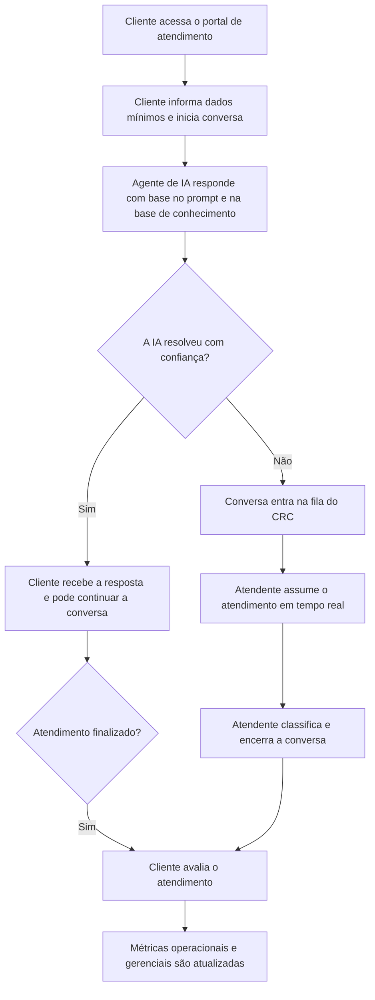

## 1. Visão Geral do Produto
Plataforma de atendimento digital do CRC para centralizar conversas, operação humana, automação com IA e análises gerenciais em um único ambiente web.
- Resolve a dependência operacional do WhatsApp e reduz o impacto de bloqueios da Meta, trazendo o relacionamento para um canal próprio, auditável e mensurável.
- Gera valor ao unir atendimento em tempo real, roteamento inteligente, histórico unificado, métricas de eficiência e base de conhecimento especializada por agente.

## 2. Funcionalidades Centrais

### 2.1 Papéis de Usuário
| Papel | Método de acesso | Permissões centrais |
|---|---|---|
| Cliente/Cooperado | Acesso ao portal de atendimento com identificação simples | Iniciar conversa, enviar mensagens, acompanhar resposta, avaliar atendimento |
| Atendente CRC | Login com nome, e-mail `@cooxupe.com.br` e senha | Atender conversas, assumir handoff da IA, responder em tempo real, classificar e finalizar chamados |
| Supervisor/Gestor | Login com e-mail `@cooxupe.com.br` e perfil elevado | Monitorar fila, SLAs, produtividade, motivos de transferência, satisfação e indicadores operacionais |
| Administrador | Login com e-mail `@cooxupe.com.br` e perfil administrativo | Gerenciar usuários internos, agentes de IA, prompts, bases de conhecimento, configurações e permissões |

### 2.2 Módulos de Funcionalidade
1. **Portal de atendimento do cliente**: início de conversa, identificação, chat em tempo real, histórico recente e avaliação.
2. **Console operacional do CRC**: fila em tempo real, inbox por atendente, handoff IA para humano, status, tags e respostas rápidas.
3. **Gestão e analytics**: visão executiva com volume, SLA, taxa de resolução pela IA, taxa de transferência, CSAT e produtividade por time.
4. **Administração e conhecimento**: cadastro de agentes, prompts, documentos da base de conhecimento, usuários internos e auditoria.

### 2.3 Detalhamento das Páginas
| Nome da página | Nome do módulo | Descrição da funcionalidade |
|---|---|---|
| Portal de atendimento | Boas-vindas orientada | Explica o canal, define expectativa de resposta e incentiva início rápido da conversa |
| Portal de atendimento | Identificação inicial | Coleta nome, contato e dados mínimos do cliente para abertura do atendimento |
| Portal de atendimento | Chat em tempo real | Exibe mensagens do cliente, da IA e do atendente, com status de leitura e indicador de digitação |
| Portal de atendimento | Avaliação final | Permite nota rápida, comentário opcional e motivo de insatisfação |
| Login interno | Autenticação corporativa | Permite cadastro e acesso somente com e-mail `@cooxupe.com.br`, senha segura e fluxo de recuperação |
| Console CRC | Fila de atendimento | Lista conversas novas, em atendimento, aguardando cliente, finalizadas e transferidas |
| Console CRC | Janela de conversa | Mostra histórico completo, dados do cliente, contexto resumido pela IA e composição de resposta |
| Console CRC | Handoff inteligente | Permite que o atendente assuma a conversa, devolva para a IA ou acompanhe em modo copilot |
| Console CRC | Classificação e encerramento | Registra assunto, categoria, sentimento, desfecho e motivo de transferência |
| Dashboard gerencial | Visão executiva | KPIs de volume, tempo médio de resposta, tempo médio de resolução, taxa de automação e CSAT |
| Dashboard gerencial | Monitoramento operacional | Funil de atendimentos por status, fila por horário, backlog, alertas de SLA e ocupação do time |
| Dashboard gerencial | Performance por agente | Compara agentes de IA e atendentes por resolução, transferências, satisfação e tempo |
| Dashboard gerencial | Base analítica | Tabelas filtráveis por período, fila, categoria, agente, atendente e desfecho |
| Administração | Usuários internos | Cadastro, bloqueio, redefinição de senha e atribuição de perfis |
| Administração | Agentes de IA | Configura nome do agente, modelo Groq, system prompt, regras de transferência e limites |
| Administração | Base de conhecimento | Upload, versionamento, ativação e associação de documentos por agente |
| Administração | Auditoria | Histórico de ações administrativas, alterações de prompt e eventos críticos |

## 3. Processo Central
O cliente acessa o portal de atendimento e inicia a conversa com identificação simples. O agente de IA responde primeiro com base no prompt configurado e na base de conhecimento associada. Se a confiança cair, o cliente solicitar humano ou uma regra de negócio exigir, a conversa é transferida para a fila do CRC. O atendente assume em tempo real, finaliza o caso e o sistema registra métricas operacionais e gerenciais. Gestores acompanham o desempenho consolidado pelo dashboard interno.

## 4. Design da Interface
### 4.1 Estilo Visual
- Cores principais: verde profundo institucional, grafite elegante, marfim técnico e cobre suave para destaques.
- Estilo dos botões: cantos amplos, profundidade sutil, foco visível e sensação premium sem excesso visual.
- Tipografia: títulos com presença editorial sofisticada e textos operacionais com leitura limpa e alta densidade informacional.
- Estilo de layout: desktop-first com áreas distintas para operação, gestão e atendimento; navegação lateral no ambiente interno e composição centralizada no portal do cliente.
- Estilo de ícones: ícones lineares refinados, estados operacionais por cor e badges discretos para prioridade, SLA e origem da resposta.

### 4.2 Visão Geral das Páginas
| Nome da página | Nome do módulo | Elementos de UI |
|---|---|---|
| Portal de atendimento | Boas-vindas orientada | Hero de confiança, blocos de ajuda rápida, botão primário de iniciar conversa e texto institucional objetivo |
| Portal de atendimento | Chat em tempo real | Balões elegantes, timeline clara, chips de origem da mensagem, indicador de digitação e composer fixo |
| Login interno | Autenticação corporativa | Card de acesso premium, feedback de validação do domínio, mensagens claras e recuperação de senha |
| Console CRC | Fila de atendimento | Colunas operacionais, filtros persistentes, cards de conversa e destaque visual para SLA em risco |
| Console CRC | Janela de conversa | Painel em três áreas com histórico, contexto e ações rápidas para respostas e transferência |
| Dashboard gerencial | Visão executiva | KPIs narrativos, gráficos combinados, heatmaps horários e cartões comparativos por período |
| Administração | Agentes e conhecimento | Tabelas elegantes, drawers laterais, editor de configuração e timeline de versionamento |

### 4.3 Responsividade
O produto adota abordagem desktop-first para a operação do CRC e para o dashboard gerencial. O portal de atendimento do cliente terá adaptação completa para mobile, com chat fluido, campos simplificados e foco em tempo de resposta. O ambiente interno será responsivo para notebook e tablet horizontal, preservando densidade útil de informação.

## 5. Diretrizes Funcionais Prioritárias
- O login interno exigirá obrigatoriamente e-mail com domínio `@cooxupe.com.br`, validado no frontend e no backend.
- O canal do cliente será independente do login corporativo para não criar fricção no início do atendimento.
- O agente inicial será o **Assistente do Salesforce**, usando o arquivo `SYSTEM PROMPT - Assistente Salesforce` como prompt de sistema inicial.
- A integração com a Groq será feita por variável de ambiente segura, nunca embutida no código ou em documentos públicos.
- O sistema deverá suportar operação híbrida: IA autônoma, IA com supervisão e atendimento humano direto.
- Toda conversa deverá gerar eventos auditáveis para análise posterior de jornada, qualidade e conformidade.

## 6. Métricas de Sucesso do Produto
- Reduzir dependência de atendimento via WhatsApp como canal principal.
- Medir taxa de resolução da IA sem intervenção humana.
- Medir taxa de transferência para atendente e os principais motivos.
- Monitorar tempo de primeira resposta, tempo de resolução e backlog por faixa horária.
- Acompanhar satisfação do cliente ao final do atendimento.
- Comparar performance entre agentes de IA, atendentes e tipos de assunto.

## 7. Suposições Iniciais do MVP
- O primeiro canal será o portal próprio do CRC, sem necessidade de integrar WhatsApp na versão inicial.
- O cliente poderá iniciar conversa com identificação simples, sem criar conta completa.
- Usuários internos serão cadastrados com nome, e-mail corporativo e senha.
- A primeira base de conhecimento será focada no agente `Assistente do Salesforce`.
- O dashboard atual de análises poderá evoluir para um módulo de gestão dentro do mesmo produto, em vez de permanecer como aplicação isolada.
