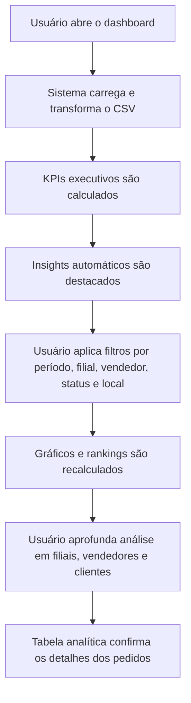

## 1. Visão Geral do Produto
Dashboard executivo e analítico para leitura do arquivo `Pedidos - Localização.csv`, com foco em volume, faturamento, produtividade comercial e padrões de local de venda.
- Resolve a dificuldade de transformar 41.728 pedidos em indicadores gerenciais acionáveis para diretoria, gestão comercial e gestores de loja.
- Gera valor ao consolidar desempenho por período, filial, vendedor, cliente e local de venda em uma experiência visual clara e profissional.

## 2. Funcionalidades Centrais

### 2.1 Módulos de Funcionalidade
1. **Dashboard principal**: KPIs, filtros globais, gráficos executivos e alertas de insights.
2. **Exploração comercial**: rankings, concentração de receita, análise por filial e por vendedor.
3. **Leitura operacional**: série temporal, distribuição por status, local de venda e tabela detalhada pesquisável.

### 2.2 Detalhamento das Páginas
| Nome da página | Nome do módulo | Descrição da funcionalidade |
|---|---|---|
| Dashboard principal | Cabeçalho executivo | Exibe título, período coberto, volume de registros e síntese textual dos principais achados |
| Dashboard principal | Filtros globais | Permite filtrar por período, filial, vendedor, status e local de venda |
| Dashboard principal | Cartões de KPI | Mostra pedidos, faturamento, ticket médio, clientes, filiais, vendedores e participação de vendas fora da filial |
| Dashboard principal | Painel de insights | Destaca anomalias e mensagens automáticas como concentração excessiva, picos diários e baixa presença de geolocalização |
| Dashboard principal | Evolução temporal | Linha ou área para valor diário e barras para volume diário de pedidos |
| Dashboard principal | Mix operacional | Gráficos de status e local de venda com comparações absolutas e percentuais |
| Dashboard principal | Desempenho por filial | Ranking de filiais por faturamento com leitura de pedidos, ticket e participação |
| Dashboard principal | Desempenho por vendedor | Ranking de vendedores com comparação entre volume e receita |
| Dashboard principal | Concentração de clientes | Visualização dos principais clientes e participação sobre a receita total |
| Dashboard principal | Tabela analítica | Lista pedidos com busca, ordenação e exportação visual dos filtros aplicados |

## 3. Processo Central
O gestor acessa o dashboard, valida o período analisado e os números consolidados, identifica alertas relevantes, aplica filtros por unidade ou vendedor, investiga picos de receita e compara a contribuição entre filial e fora da filial. Em seguida, cruza rankings e série temporal para descobrir concentração comercial, dependência de poucos clientes e oportunidades de atuação regional.

## 4. Design da Interface
### 4.1 Estilo Visual
- Cores principais: fundo grafite profundo, superfícies azul-petróleo e acentos em dourado queimado e verde-lima para destaque analítico.
- Estilo dos botões: retângulos amplos com cantos médios, contraste alto e estados de foco evidentes.
- Tipografia: fonte de impacto editorial nos títulos e fonte de leitura limpa nos conteúdos e tabelas.
- Estilo de layout: desktop-first, painéis modulares em grade com sensação de central de inteligência comercial.
- Estilo de ícones: ícones lineares refinados com destaque pontual em métricas críticas e tendências.

### 4.2 Visão Geral da Página
| Nome da página | Nome do módulo | Elementos de UI |
|---|---|---|
| Dashboard principal | Cabeçalho executivo | Título forte, subtítulo contextual, chips do período e bloco de narrativa executiva |
| Dashboard principal | Filtros globais | Comboboxes, seletores de intervalo, chips ativos e botão de limpar filtros |
| Dashboard principal | Cartões de KPI | Cards premium com números grandes, deltas, mini barras e microtexto explicativo |
| Dashboard principal | Painel de insights | Blocos narrativos com sinalização por cor, badges e frases gerenciais curtas |
| Dashboard principal | Evolução temporal | Gráfico de área com sobreposição sutil, tooltip rico e destaque para dias de pico |
| Dashboard principal | Mix operacional | Roscas ou barras empilhadas para status e local de venda |
| Dashboard principal | Desempenho por filial | Barras horizontais ordenadas com valor, participação e ticket |
| Dashboard principal | Desempenho por vendedor | Barras ou scatter comparando receita e volume |
| Dashboard principal | Concentração de clientes | Treemap ou barras com peso visual para grandes contas |
| Dashboard principal | Tabela analítica | Tabela escura elegante, ordenável, com busca textual e colunas formatadas |

### 4.3 Responsividade
O projeto adota abordagem desktop-first com adaptação para tablets e mobile. Em telas menores, os filtros migram para painel recolhível, os cards são reorganizados em colunas e os gráficos priorizam leitura vertical com tooltips simplificados.

## 5. Insights Prioritários do Produto
- A base cobre o período de `05/06/2026` a `16/07/2026`, com `41.728` pedidos e faturamento de `R$ 197,2 milhões`.
- O status `Integrado` concentra a maior parte da receita, enquanto `Fechado` representa volume menor e deve ser tratado como indicador de etapa operacional distinta.
- O campo `Informação da Geolocalização` está completamente vazio, então o produto precisa explicitar essa limitação logo no topo para evitar interpretações equivocadas.
- `Fora da Filial` representa baixo volume de pedidos, mas faturamento relevante, sugerindo necessidade de monitoramento separado.
- Há forte concentração de receita em poucas filiais, poucos vendedores e alguns clientes muito grandes, o que justifica painéis de concentração e dependência comercial.
- Existem dias de pico com ticket médio muito acima do padrão, indicando presença de grandes pedidos que precisam ser destacados visualmente.
